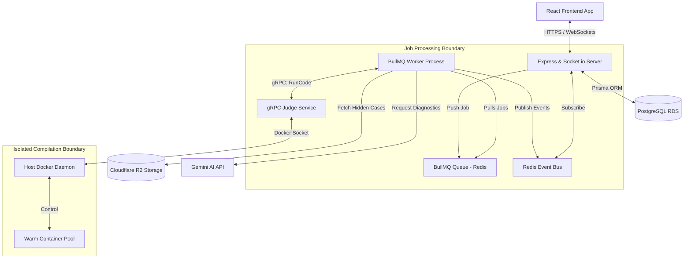

# ChallengX 🚀

**ChallengX** is a high-octane, real-time competitive programming platform designed for developers to face off in head-to-head coding battles, run team-based wars, and spectate live matches. Built using a decoupled, event-driven microservices architecture, ChallengX delivers isolated sandboxed code execution, real-time state synchronization, and AI-powered performance diagnostics.

---

## 🌟 Core Features (Current Focus)

### 🥊 1v1 Battles
*   **Real-Time Code Duels**: Compete head-to-head against opponents in live coding matches.
*   **Synchronized Editors**: Responsive split-screen environment with real-time compilation, code synchronization, and syntax highlighting.
*   **Automated Verification**: Immediate testcase evaluation with instant pass/fail validation.
*   **Matchmaking & Queue**: Smart queuing engine to pair developers based on skill ratings (Elo/RankPoints).

### 👥 Team Battles (Wars)
*   **Guild-Style Wars**: Create teams, generate custom team join-codes, and battle other teams.
*   **Pair Matchups**: Multi-player team matchups resolved through parallel individual pairings.
*   **Live Team Scoreboard**: Real-time aggregation of points to determine the winning guild.

### 👁️ Spectator Mode
*   **Live Stream Broadcasts**: Spectators can join active battle rooms to watch code editors and run progress in real-time.
*   **Technical esports Hype**: Integrated **Gemini AI Commentator** broadcasting live esports-style commentary directly into spectator feeds.

---

## 🔮 Future Roadmap

### 🏆 Scheduled Live Contests
*   Organized, time-bound programming tournaments with scheduled countdown timers and difficulty tiers (Easy, Medium, Hard).
*   Live scoring systems utilizing execution speed coefficients and hints-used deductions.

### 🎮 Squid Game Tournaments 🦑
*   A **50-player progressive elimination mode** spanning 5 rounds of increasing problem difficulty.
*   Automatic stage timeouts and elimination loops where the bottom $X\%$ of performers are deleted from the roster until the last coder stands.

---

## 🏗️ Backend System Architecture

ChallengX operates on a highly scalable, event-driven hybrid microservices architecture designed to isolate expensive code execution runs from the primary API serving loops:



### Core Architecture Components

1.  **API Gateway & Websockets (Express & Socket.io)**:
    *   Exposes secure REST routes, handles JWT credential rotation, and coordinates Socket.io rooms (e.g., matchmaking, spectator channels).
    *   Subscribes to a Redis Pub/Sub channel (`worker_events`) to dynamically stream compilation status changes down to client browser sessions.
2.  **Distributed Task Queue (BullMQ & Redis)**:
    *   Offloads compilation requests from the primary event loop. Jobs are safely persisted and processed asynchronously.
3.  **Job Execution Worker (`backend/worker/worker.js`)**:
    *   A stateless Node.js runner that fetches hidden testcase payloads from **Cloudflare R2 (S3)**, makes gRPC compiler calls, interacts with Gemini AI, and commits user rating changes directly to **PostgreSQL**.
4.  **Sandbox Judge microservice (`judge-service`)**:
    *   A high-performance gRPC server that maintains a warm pool of sandboxed Docker containers (Python, JavaScript, Java, C, C++).
    *   **Strict Security Sandboxing**: Containers run network-disabled, with strict resource envelopes: **512MB RAM**, **2.0 CPU cores**, and **512 process limits**.

---

## 🛠️ Technology Stack

*   **Frontend**: React (Vite), Redux Toolkit, Tailwind CSS, Socket.io-client.
*   **Backend API**: Node.js, Express.js, Socket.io, Prisma ORM, PostgreSQL.
*   **Job Processing**: BullMQ, Redis.
*   **Code Sandbox**: gRPC, Protocol Buffers, Docker API.
*   **AI Diagnostics**: Gemini-1.5-flash & Gemini-1.5-pro (`@google/generative-ai`).
*   **Telemetry**: Prometheus (`prom-client`), Winston Logger.

---

## ⚙️ Quick Start

### Prerequisites
*   Node.js (v20+)
*   Docker Desktop (Active)
*   PostgreSQL & Redis

### Local Development Setup

#### 1. Setup Environment Files
Create `.env` in the `/backend` and `/frontend` folders based on the configurations:
*   [backend/.env](file:///d:/challeng-x/backend/.env) should have database, Redis, S3, Google/Github client keys, and your `GEMINI_API_KEY`.
*   [frontend/.env](file:///d:/challeng-x/frontend/.env) must point `VITE_API_BASE_URL` to `http://localhost:4000/api`.

#### 2. Build sandbox runner images
```bash
npm run docker:build --prefix backend
```

#### 3. Spin up services (in separate terminals)
*   **Start Judge Service**:
    ```bash
    cd judge-service && npm install && npm run dev
    ```
*   **Seed PostgreSQL Schema**:
    ```bash
    cd backend && npm install && npx prisma migrate dev && npx prisma db seed
    ```
*   **Start Backend API**:
    ```bash
    cd backend && npm run dev
    ```
*   **Start Queue Worker**:
    ```bash
    cd backend && npm run worker
    ```
*   **Start Frontend**:
    ```bash
    cd frontend && npm install && npm run dev
    ```
    Open `http://localhost:3000` to competition!

---

### Docker Compose Setup (Single-Command Run)

To run the complete backend services stack in containerized production mode, cd into the new directory:
```bash
cd docker
docker compose -f docker-compose.v2.yml up -d --build
```
This automatically spins up Nginx, the API server, database tables, the worker process, Redis, and the Judge microservice.

---

### 📊 Observability & Metrics

*   **Prometheus endpoint**: Exposes API performance, cache hits, queue depth, and runner times at `http://localhost:4000/metrics`.
*   **Winston Logger**: Keeps daily gzipped log files inside `/backend/logs`.
