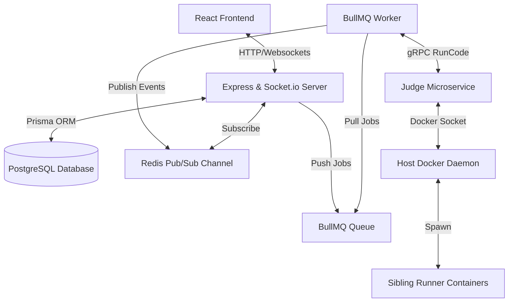

# ChallengX 🚀

**ChallengX** is a competitive programming platform where students can participate in 1v1 coding battles, join live contests, and compete in team-based wars. The platform features a modern UI, real-time updates, leaderboards, and a robust backend powered by Node.js, Redis, and PostgreSQL.

## 🌟 Key Features

### 🥊 1v1 Battles
- Real-time competitive programming matches with code execution
- Split-screen editor with syntax highlighting
- Automated judging with instant feedback
- Matchmaking and rematch system

### 🏆 Live Contests
- Scheduled coding contests with countdown timers
- Real-time leaderboards with dynamic scoring
- Problem difficulty categorization (Easy, Medium, Hard)
- Comprehensive analytics for participants and organizers

### 👥 Team Wars (Coming Soon)
- Team-based coding competitions
- Collaborative problem-solving
- Team vs team battles
- Performance tracking and analytics

### 🎮 Squid Games
- Eliminator-style coding challenges with live rankings
- Multi-stage tournaments with increasing difficulty
- Real-time leaderboard updates
- High-stakes competitions with limited eliminations

## 🛠️ Tech Stack

### Backend
- **Node.js** - High-performance JavaScript runtime
- **Express.js** - Web framework
- **Socket.IO** - Real-time communication
- **BullMQ** - Job queue system
- **ioredis** - Redis client
- **PostgreSQL** - Relational database
- **Docker** - Containerization

### Frontend
- **React** - UI library
- **Redux Toolkit** - State management
- **Tailwind CSS** - Styling
- **Material-UI** - Component library
- **Syncfusion** - Charting and scheduling
- **Socket.IO** - Real-time updates

## 📂 Project Structure

```
ChallengX/
├── backend/            # Node.js backend services
│   ├── core/           # Core modules
│   ├── modules/        # Application modules
│   ├── utils/          # Utility functions
│   └── config/         # Configuration files
│
├── frontend/           # React frontend
│   ├── src/
│   │   ├── components/ # Reusable components
│   │   ├── pages/      # Page components
│   │   ├── redux/      # Redux stores
│   │   ├── services/   # API services
│   │   └── utils/      # Frontend utilities
│   └── public/
│
└── docker/             # Docker configuration
    └── docker-compose.yml
```

## ⚙️ Setup & Installation

### Prerequisites
- Node.js (v18+)
- Docker Desktop (v4.27+)
- PostgreSQL (v17+)

### Backend Setup
```bash
cd backend
npm install
npm run dev
```

### Frontend Setup
```bash
cd frontend
npm install
npm run dev
```

### Docker Setup
```bash
cd docker
docker-compose up -d
```

## 🌐 Running the Application

Once all services are running:
1. Open **http://localhost:5173** in your browser
2. Register or log in
3. Create a match or join a contest
4. Start competing!

## 📈 Prometheus Monitoring

ChallengX includes Prometheus metrics for monitoring:
- Active/waiting jobs in the submission queue
- Container health
- Real-time statistics

Access the metrics endpoint:
```
http://localhost:4000/metrics
```

## 🏗️ Backend Architecture Overview

CodeArena is designed as a hybrid microservice architecture built to support highly concurrent real-time competitive programming events:



### Components
1. **API & Real-time Layer**: Express.js server exposing REST endpoints and managing Socket.io channels. It subscribes to Redis Pub/Sub events to push compile states back to the client.
2. **Distributed Queue**: BullMQ queues submissions asynchronously, preventing compilation runs from blocking primary user sessions.
3. **Execution Worker**: A dedicated background worker process that downloads Cloudflare R2/S3 hidden test cases, interfaces with the judge microservice over gRPC, and coordinates AI feedback.
4. **Judge Microservice**: A completely stateless gRPC service (`judge-service`) that communicates with the host `/var/run/docker.sock` to run user code inside sandboxed sibling containers.

For a full, production-level C4 container analysis and review, see [architecture_audit.md](file:///C:/Users/LOQ/.gemini/antigravity-ide/brain/604d8e6f-f943-4a8e-a12e-b5caf7fff0ae/architecture_audit.md).

